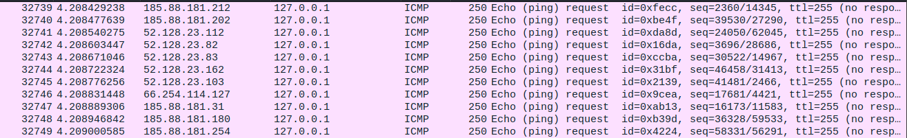

# FLOOD
Flood is a DDoS(Destributed denail of service) tool which can exploit some of the most popular DoS/
DDoS attacks.
# Features flood v0.0.1
* It Supports HTTP GET request flood DoS attack.
* It Supports ICMP ping request flood DDoS attack.
* It Supports TCP SYN flood DDoS attack.
* It Supports TCP PSH+ACK flood DDoS attack.
* It Supports UDP flood DoS attack.
* It uses spoofed source IP for the ICMP, SYN and PSH+ACK flood DDoS attack.
* It Supports both IPv4 and IPv6 addresses for all the attacks excluding the HTTP GET flood.
* It's Simple and easy to use, it allows you to use wizard if you find the commands hard remember.

# Screenshots



# Disclaimer
By using this tool you agree that you'll be helt accountable for any illegal usage.
Use this tool for only penetration testing and in ethical way!. Do not use it on any network you 
don't permission. Be White Hat Hacker 😉️😀️.

# Requirements
* Python3
* GCC compile

# Installation
* Installing flood on any unix-like OS, note that this tool will not work on windows platform.
```
git clone https://github.com/4anonz/flood.git
cd flood
chmod +x build.sh
./build.sh
./flood.py
```
# Commands

```
Usage: python3 flood [OPTIONS]
flood version: 0.0.1
ATTACKS:
--get-flood                Perform the HTTP GET request flood DoS attack.
--icmp-flood               Perform the ping ICMP flood DDoS attack.
--psh-flood                Perform the TCP PSH+ACK flood DDoS attack.
--syn-flood                Perform the TCP SYN flood DDoS attack.
--udp-flood                Perform the UDP flood DDoS attack.
HTTP flood:
-u,  --url                 Specify the URL to attack.
-p,  --port                Specify the port number for the HTTP GET reuqest flood.
GENERAL OPTIONS:
-t,  --target              Specify the target IP address/hostname.
-s,  --source              Specify a file path containing any number of spoofed source 
                            IP addresses(one per line) of this option is only available for the ICMP, 
                            TCP PSH+ACK, TCP SYN flood attacks, check the generating source IP
                            section. 
-n,  --packets             Specify the number of packets to send or Number of GET
                            requests to send for the HTTP GET request flood.
GENERATING SOURCE IP(s):
-g,  --generate            Use this option to specify the IP address of the network
                            for generating spoofed source IP(s), you can specify many ip addresses 
                            with
                            comma(,) seperated without white space.
-o,  --write               Specify the name of the output file to write the IP addresses. 
MISCELLANEOUS/MISC:
These options doesn't fit any of the category
-w,  --wizard              Use a simple wizard interface to help for beginner users.
-h,  --help                Print this help massage and exit.
-v,  --version             Print program version and exit.
```
# The --help Command
The '-h' or '--help' command just prints out the help massage and exit.
# Generating spoofed source IP
Some of the attacks requires that you specify a file containing IP addresses. The Idea is to use 
those IP addresses to spoofed the source IP address so that the target host will be sending responses 
to a falsified IP address.
The '-g'/'--generate' command help you to generate the IP address then use it with the '-o'/'--write' 
argument to write the output to the file name given.
* Example:
```
./flood.py -g 127.0.0.1 -o /home/user/source_ip.txt
```
You can also specify more than one IP address with comma(,) seperated.(without white space)
* Example2:
```
./flood -g 127.0.0.1,10.0.0.2,192.168.43.3 --write /home/user/source_ip.txt
```

# The --wizard Command
The '-w' or '--wizard' commands can be used to launch the UI which will guide you to perform your 
desired task. this is useful if you find the commands quite difficult to remember!.
* Example:
```
./flood.py --wizard
```
# --get-flood command
The --get-flood command is used for performing HTTP GET flood DoS attack.
* Arguments
Use the '-u' or '--url' flag to specify the target(or website) URL.
Use the '-p' or '--port' flag to specify the port number of the attack. This is optional, if not 
specified then flood will default to port 80.
Use the '-n' or '--packets' flag to specify the number of requests to send. This argument is required
for all the attacks.
* Example:
```
./flood.py --url URL -n 12500 --get-flood
```
# --icmp-flood command
The --icmp-flood command is use for exploiting the ICMP ping flood DDoS attack.
* Arguments
Use the '-t' or '--target' to specify the target's hostname or IP address.
Use the '-s' or '--source' to specify a file contaning spoofed source IP addresses, This argument is
required for all the attacks excluding the HTTP GET flood and UDP flood attacks.
* Example:
```
./flood.py --icmp-flood -t 127.0.0.1 -s /home/user/source.txt --packets 1920000
```
# --psh-flood command
This command is use for exploiting the TCP PSH+ACK flood DDoS attack.
* Example:
```
./flood.py --psh-flood -t 127.0.0.1 --port 80 -s /home/user/source.txt -n 192000
```
# --syn-flood command
This command is use for exploiting the TCP SYN flood DDoS attack.
* Example:
```
./flood.py -n 19200 -p 80 -t 127.0.0.1 -s /home/user/source.txt --syn-flood
```
# --udp-flood command
This command is use for flooding the target host with UDP packets.
It accepts only 2 arguments.
* Example:
```
./flood.py --target 127.0.0.1 --packets 192002 --udp-flood
```
# Author
Anonymous Hacks(4anonz) - I am White Hat😎️.
# Suggestions and Feedback
Please [contact me](digitalguru64@gmail.com) if you have any feedback or suggestions or any bogus you
want to report.
Facebook [Anonymous Hacks](https://facebook.com/4anonz).